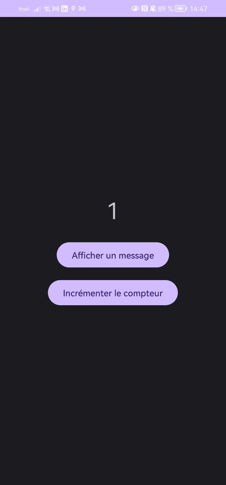
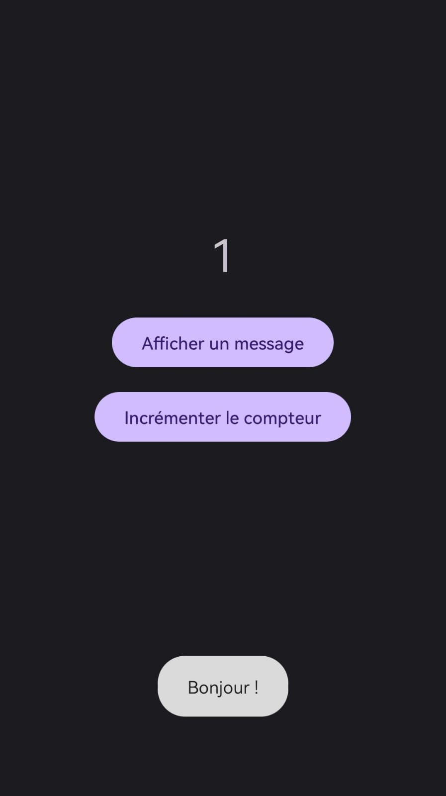
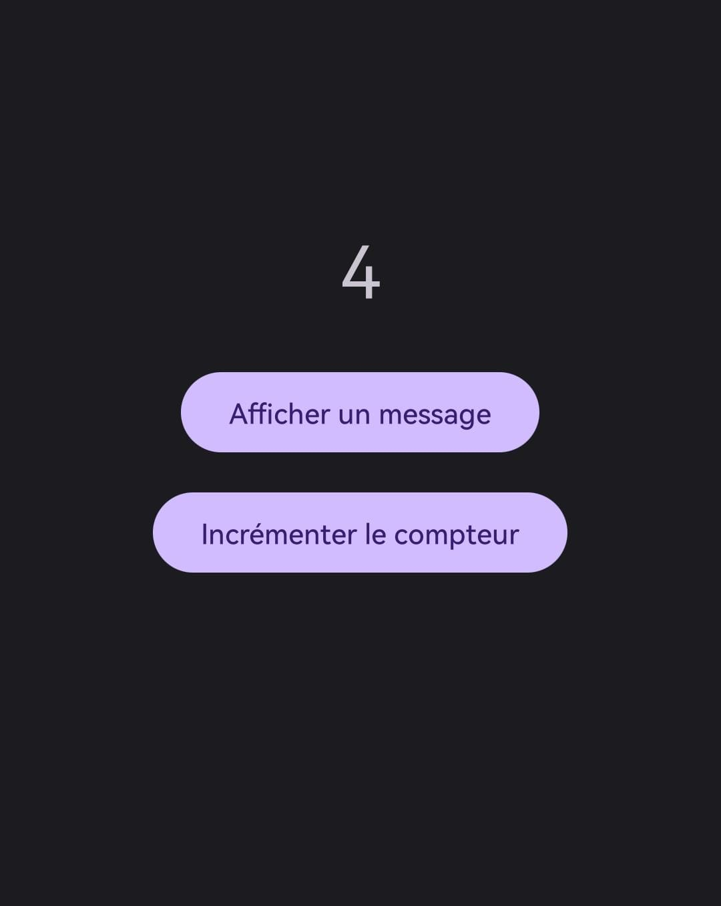

#  LAB 1 – HelloToast
### Interface de l’application

## Toast affiché
Lorsque l'utilisateur clique sur le bouton, un message "Bonjour !" s'affiche.

##  Incrémentation du compteur
Le compteur augmente à chaque clic sur le bouton.

##  Exécution
L'application a été testée sur un téléphone réel en utilisant le débogage USB, au lieu d’un émulateur.
